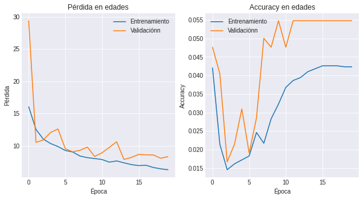

# Prediction models of age and gender on faces images

This project aims to create models that are capable of determining the age and gender of a person from a photograph of their face, in such a way that these models are useful as a starting point for someone who wants to create a face identifier from a person's image.

## About this project

The methodology and description of what this project is made of are shown in the next list:

* 1. Data preparation: The images used are loaded in the code inside this folder.
* 2. Features extraction: Some preprocessing operations are made in this code to extract features of the images set.
* 3. Models and evaluation: Convolutional neural networks are built and transfer learning is also made to train a model with the images loaded, all of this in the files: [Convolutional.ipynb](https://github.com/cagutierrezgu/My_Portfolio/blob/e1cda73b1c671396eaa298fefdb30352f91c9488/Faces%20and%20gender%20prediction/3.%20Models%20and%20evaluation/1.%20Convolutional.ipynb), [InceptionV3.ipynb](https://github.com/cagutierrezgu/My_Portfolio/blob/e1cda73b1c671396eaa298fefdb30352f91c9488/Faces%20and%20gender%20prediction/3.%20Models%20and%20evaluation/2.%20InceptionV3.ipynb). The models are evaluated with the appropriate metrics to judge the performance of each of them.

## Models and results

One of the models used was a convolutional neural network, whose objective is to predict the age and gender of the person in the image. This network, in general, is made up of combinations between convolution and pooling layers, as well as two different outputs, each one to predict the age and gender labels that have dense and dropout layers before each output of the neural network. The architecture of the first neural network built is the following

The results for the gender predictions of this specific neural network are shown in the next loss and accuracy graphs across the epochs of the model

And what was obtained for the age predictions are the following

The previous graphs show that the loss and accuracy for the validation set have large fluctuations over the epochs, which may be due to the structure of the neural network used. Even so, the accuracy remains above 80% in the vast majority of times for the gender predictions. On the other hand, the results of the age predictions in terms of the accuracy shows really low scores, which could be due to the structure of the neural network and/or hyperparameters such as the learning rate.

Trying to improve the previous results, another convolutional neural network was created with regularizers in the convolution layers, so that together with the dropout layers get a non-overfitting model. Then, the results for the gender predictions were

And the ones for the age predictions

Unlike the results of the first neural network, the fluctuations that are presented now are quite minor, and the accuracy remains at values similar to those observed in the previous case, indicating good results in general. Nevertheless, the capacity of predictability of a person's age of the model is still low.

Another model studied was an InceptionV3 neural network, which was retrained using transfer learning taking into account the problem what was needed to solve in this project. It was trained just for gender predictions, and its results for these feature are the following

The graphs present a smooth behavior compared to those seen in the previous models, with a fairly high prediction rate that rests on 80% of success.

In order to see the capacity of prediction of this models, and analyze those predictions on specific images, it is now shown with the model of convolutional networks with regularization

Showing good results for the specific image used.

## Conclusions

The most relevant findings seen in the analysis done are the following:

* Convolutional neural networks created without any pre-trained neural networks showed pronounced fluctuations in their loss and accuracy plots as a function of training epochs. That behavior was improved by using more regularization tools, however, other important points like a new architecture, a different learning rate and a greater variety of data that cover the entire spectrum of ages could improve the behavior observed.
* The neural network with the best results in the evaluated metrics was the convolutional neural network with the most regularizers, obtaining a predictability of around 85% of the gender of a person. Even so, the best behaved model according to its loss and accuracy graphs was the transfer learning model, since its curves are those expected in a model that is neither underfit nor overfit.
* One of the elements to be argued and corrected in subsequent studies is the way the models are evaluated in its predictions of age, it should be avoided to work with all the years separately, leaving around 120 possible values for age, but rather grouping them into sets of 5, 10 or 20 years in order to give a wider margin of error to the evaluation.
* In general terms, different initial models were implemented in the way of knowing different characteristics of a person, in this case were their age and gender, which are useful if you want to build a face identifier, for which you need to take into account more information.
